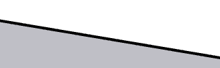

# Native viewport and antialiasing

## Final configuration

```text
FINAL_GRAPHICS_ENGINE=Classic
FINAL_GRAPHICS_API=OpenGL/WGL 4.6 Compatibility Profile
FINAL_GPU=Intel Arc Graphics (MTL), Core Ultra 7 155H
FINAL_DRIVER=Mesa 26.0.8-1ubuntu0.3
FINAL_TRANSLATION_LAYER=Wine WGL -> host Mesa OpenGL through Xwayland/sniper
FINAL_AA_METHOD=PrivatePreferences AAMethod=8, Classic MSAA
FINAL_AA_LEVEL=8x
FINAL_FAST_FEEDBACK_SETTING=UseFastFeedback=false
FINAL_DPI_SETTING=Wine LogPixels=192; prefix HIGHDPIAWARE; existing GNOME scale=2x
FINAL_VIEWPORT_RESOLUTION_BEHAVIOR=1083x808 logical -> 2166x1616 native framebuffer
SOFTWARE_RENDERING_FALLBACK=NO
HARDWARE_ACCELERATION=PASS
```

The final launch log identifies `GL_VENDOR: Intel`, `GL_RENDERER: Mesa Intel(R) Arc(tm) Graphics (MTL)` and OpenGL 4.6 Mesa 26.0.8. Live canonical process file descriptors use `/dev/dri/renderD128`. DXVK/Vulkan device enumeration also occurs during capability probing; it is not the modeler's rendering API. Vulkan capability was 1.4.341. The llvmpipe device was enumerated but not selected for the modeler. CEF alone has its GPU path disabled by `SU_CEF_DISABLE_GPU=1`.

The [SketchUp graphics documentation](https://help.sketchup.com/en/sketchup/graphics) explains engine and AA preferences. The actual installed Classic preferences dialog offered disabled, 2x, 4x, 8x and 16x, requiring a restart. A GUI 2x selection saved numeric AAMethod=2; subsequent 4 and 8 settings produced increasing edge coverage. The initial startup pixel-format diagnostic saying MSAA 0 is a capability probe and does not describe every later rendering surface.

## Controlled comparison

All captures use the same saved 12-edge, 6-face Push/Pull solid, camera, 3072x1856 application window, 3072x1920 panel, 192 Wine DPI and 2x GNOME scale. Original full-resolution captures remain in the local workspace `artifacts/`. The 2x/4x/8x Ruby metadata has identical camera and geometry. [SketchUp's View API](https://ruby.sketchup.com/Sketchup/View.html) reports physical device dimensions; `write_image(source: :framebuffer)` produced a 2166x1616 image, matching the on-screen modeling surface. No desktop resolution change or blur was applied.

| Setting | Same diagonal edge crop: distinct coverage colors | Result |
| --- | ---: | --- |
| Disabled / 0 | 3 | Visible staircase; rejected |
| 2x | 5 | Smoother but less coverage precision than 4/8 |
| 4x | 9 | Good edges; benchmark candidate |
| 8x | 17 | Selected: best of the tested levels with similar redraw cost |

16x was visible in the UI but was not tested or selected. No claim is made that 8x is the fastest or highest quality setting for every model/GPU.

These are **unscaled 320x100 pixel crops** of the same native screenshot rectangle `(1050,1320)-(1370,1420)`. They contain only the test solid edge and background, with no account or desktop information.

Disabled:


4x:



Final 8x:


The native red-axis crop `(1880,1460)-(2120,1530)` contained 2, 3, 5 and 8 coverage colors at disabled/2x/4x/8x respectively. Intermediate edge pixels increase; flat face interiors retain their original values. Diagonal model edges and axes are smoother while menu text, toolbar controls and the native viewport remain sharp. Full-window before/after evidence was not resized to create this result.

## Performance and regression

The repeatable local benchmark performed 90 synchronous small camera rotations and native redraws on the same simple model, then restored the camera. It measures this small scene, not a production workload or guaranteed display FPS.

| AA | Mean redraw | 95th percentile | Maximum |
| --- | ---: | ---: | ---: |
| 4x | 18.52 ms | 19.17 ms | 19.85 ms |
| 8x | 18.77 ms | 19.54 ms | 20.12 ms |

Real mouse Orbit, Shift+middle Pan and wheel Zoom changed the camera promptly without losing geometry. Face and edge selection, Line endpoints, Rectangle corners, Push/Pull, deletion, toolbar/menu/tray controls and Save As passed at the final setting. Save/reopen preserved all 12 edge endpoint pairs and six faces. Maximize and restore changed physical framebuffer size consistently with the window. No new BugSplat or late crash occurred in the final regression and three subsequent cold launches.

An idle 3.00-second sample used about 3.0% of one CPU core across the prefix. Summed RSS was 2.10 GiB; shared mappings are counted separately per process in that figure. Large scenes, prolonged production use, advanced materials, cloud services and third-party extensions are untested.

## Local full-resolution evidence hashes

```text
bbcca192219723004114bcfb3c6ad0e3392228164348abed6da3c2f7ec69a466  viewport-aa-2x-framebuffer.png
8adaa11aa0a88c3c4affb89a72356c389fb8b4b74ee2cb963aa4f9ec83f14159  viewport-aa-2x.png
5165d2193ba3acec2f73e96128f7c667ecd8d1ccc87b636a5608c1f644dad6e2  viewport-aa-4x-framebuffer.png
ffa30521a3107c3a99c4b30e7088999c69d6c0b2505df676a63a3a4e2f301473  viewport-aa-4x.png
7a163a11835d5532d8a07ff1a2326859b4670941ae0d7b5b3a7f59b718c0ec66  viewport-aa-8x-framebuffer.png
4f96e6d3bff6c475d073bc084bdc214f872fdefc95498ea0958f2d6d0aa71ef4  viewport-aa-8x.png
4f96e6d3bff6c475d073bc084bdc214f872fdefc95498ea0958f2d6d0aa71ef4  viewport-aa-after.png
049a8f3239a0a19f0b9fab63eec4d969409c219ec0eeff5f9dca17a1af323056  viewport-aa-before.png
```

Private model files and framebuffer metadata are not redistributed. The public crops above are derived from the exact full-resolution captures identified by these hashes.
